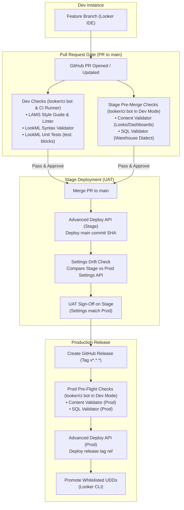
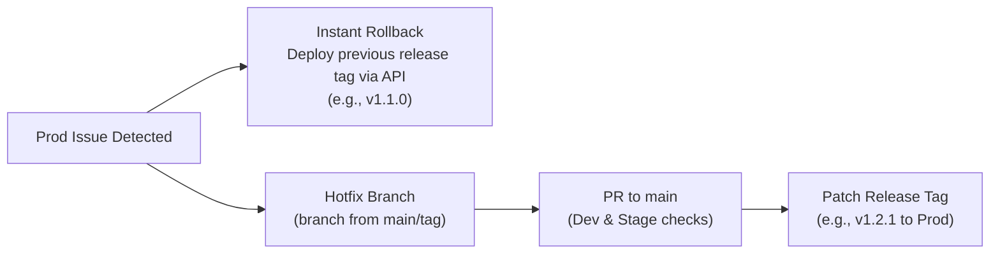

# Multi-instance Looker CI/CD

Deployment workflow, testing gates, and API automation across three Looker environments: Dev, Stage (UAT), and Prod.

## Tools and technologies

| Tool | Purpose | Documentation / Repository |
| :--- | :--- | :--- |
| **Looker CLI (`looker-cli`)** | CLI for Looker API session management, branch checkouts, project validation, content validation, and deployment | [github.com/looker-open-source/looker-cli](https://github.com/looker-open-source/looker-cli) |
| **LAMS (`@looker/look-at-me-sideways`)** | LookML style guide linter and rule validator (e.g. Rule F2 field descriptions) | [github.com/looker-open-source/look-at-me-sideways](https://github.com/looker-open-source/look-at-me-sideways) · [Docs](https://looker-open-source.github.io/look-at-me-sideways/) |
| **Looker API 4.0** | REST API for Advanced Deploy, Content Validator, Settings parity, and PDT builds | [developers.looker.com/api/explorer/4.0](https://developers.looker.com/api/explorer/4.0) |
| **GitHub Actions** | CI/CD automation pipelines for PR gates, Stage deployment, and Prod releases | [github.com/features/actions](https://github.com/features/actions) |
| **jq** | Command-line JSON processor for Looker API response parsing and migration scripts | [jqlang.github.io/jq](https://jqlang.github.io/jq/) |

## Architecture overview



## Environment matrix

| Environment | Purpose | Developer LookML Access | LookML Source / Trigger | Deployment Method | Instance Settings & Feature Parity | Database Warehouse |
| :--- | :--- | :--- | :--- | :--- | :--- | :--- |
| **Dev** | Feature development and experimentation | **Read / Write** (IDE feature branches & personal Dev Mode) | Personal developer branches | Looker IDE git checkout | Previews, Labs flags, and experimental features can be turned on for testing | Dev warehouse dataset |
| **Stage** | UAT testing and pre-production validation | **No Write Access** (Read-only / UAT; automated via CI/CD) | `main` branch (deployed on PR merge) | Advanced Deploy API | Must match Prod settings, enforced by CI drift checks | Staging / masked warehouse dataset |
| **Prod** | Production analytics for end users | **No Write Access** (Read-only / consumption; automated via CI/CD) | Semantic release tags (`v*.*.*`) | Advanced Deploy API | Production baseline configuration | Production warehouse dataset |

## CI/CD validation and testing gates

Validations run through the `looker/ci` bot service account with scoped workspace privileges.

```
                  ┌──────────────────────────────────────────────┐
                  │                 Pull Request                 │
                  └──────┬────────────────────────────────┬──────┘
                         │                                │
            [ Dev & CI Runner Target ]          [ Stage Instance Target ]
            ┌─────────────────────────┐         ┌───────────────────────┐
            │ • LAMS Style Guide Lint │         │ (bot enters Dev Mode) │
            │ • LookML Validation     │         │ • Content Validator   │
            │ • LookML Unit Tests     │         │ • SQL Validator       │
            │   (test: blocks)        │         │                       │
            └─────────────────────────┘         └───────────────────────┘
```

### Pull request to main (Dev and Stage gates)

When a developer opens a pull request against `main`, GitHub Actions runs two validation tracks:

Dev and runner checks:
- LAMS ([looker-open-source/look-at-me-sideways](https://github.com/looker-open-source/look-at-me-sideways)) lints changed LookML files for style rules, naming conventions, primary keys, and description coverage.
- The `looker/ci` service account runs `validate_project` on Dev to catch syntax errors, broken references, and invalid joins.
- Native LookML `test:` blocks run through `run_lookml_test` to verify calculations and dimension assertions.

Stage pre-merge checks:
- The bot logs in with `looker-cli session login --token-file` and switches its session to Dev mode (`echo '{"workspace_id":"dev"}' | looker-cli api session update_session - --token-file`).
- Checks out the PR branch with `looker-cli project checkout <project_id> <branch> --token-file`.
- Runs the Content Validator in Dev mode (`looker-cli api content content_validation --project_names <project_id> --token-file`) to catch broken Looks and dashboards before merge.
- Runs explore queries against the staging warehouse connection to verify dialect compatibility.

### Stage promotion on merge

When the PR merges into `main`, GitHub Actions deploys the code to Stage:

- Calls the Advanced Deploy API endpoint `POST /api/4.0/projects/{project_id}/deploy_ref_to_production?ref={commit_sha}` via Looker CLI (`looker-cli api project deploy_ref_to_production`).
- Compares Stage and Prod settings via `looker-cli api config get_setting` and `diff -u` to confirm settings parity.
- Stakeholders and analysts run UAT against Stage knowing the environment configuration matches Production.

### Production release on tag

When a release tag (`vX.Y.Z`) is created, GitHub Actions executes the release workflow on Prod ([.github/workflows/release-prod.yaml](.github/workflows/release-prod.yaml)):

1. Switches Prod session to `dev` mode with `--token-file`.
2. Checks out the release tag ref (`tags/vX.Y.Z`).
3. Runs Content Validator and SQL validation in Dev mode against live production metadata.
4. Triggers and validates Persistent Derived Table (PDT) builds in Dev mode to pre-warm warehouse tables and verify DDL execution before live traffic touches them.
5. Deploys the release tag to Production once all Dev mode validations and PDT builds pass:
   `looker-cli api project deploy_ref_to_production <project_id> --ref tags/vX.Y.Z --token-file`
6. Verifies Stage vs Prod settings parity via `looker-cli api config get_setting` and `diff -u` before migrating content.
7. Promotes whitelisted UDD content, Boards, and Conversational Analytics Agents strictly from Stage to Production. This step runs only after all production release validators, deployment, and settings parity checks succeed.

## Content, board, and agent migration (Stage to Prod)

LookML models and explores deploy through Git, while User-Defined Dashboards (UDDs), Looks, Boards, and Conversational Analytics Agents verified during Stage UAT migrate from Stage to Prod using Looker CLI ([looker-open-source/looker-cli](https://github.com/looker-open-source/looker-cli)). Promotion runs only after all production release validations pass.

Dev content is never promoted automatically. The Dev instance is a developer sandbox for fast iteration and local testing. To bring dashboards from Dev into the release lifecycle, convert them to LookML Dashboards (`.dashboard.lookml` files) so they are version-controlled in Git and deploy across all environments. For one-off transfers, developers can run ad-hoc `looker-cli` commands (`looker-cli dashboard export <id>` and `looker-cli dashboard import <file>`).

### Shared folder whitelist

To keep personal folders and experimental UAT scratchpads out of Production, migrations only process folders listed in `config/content_folders_whitelist.yaml` (which always assumes Looker's root Shared folder):

```yaml
whitelist:
  - "CICD Demo"
  - "Executive Dashboards"
  - "Finance"
  - "Marketing Operations"
  - "Product Analytics"
```

Migration rules:

- Personal spaces under `/users/*` are ignored.
- Unlisted subfolders under `Shared/` are skipped.
- Folders are exported from Stage with `looker-cli folder export <folder_id> --dir ./content_export --host $LOOKER_STAGE_BASE_URL` and imported into Prod with `looker-cli folder import ./content_export/<folder_name> <prod_parent_id> --host $LOOKER_PROD_BASE_URL`.
- The migration runs via `.github/workflows/promote-udd-content.yaml` on release or manual trigger.

### Board migration by title

Because Looker internal database IDs differ across instances, Boards cannot be migrated by static IDs. Instead, `scripts/migrate_boards_cli.sh` resolves Board titles, sections, and pinned dashboards/looks across environments using `config/content_boards_whitelist.yaml`:

```yaml
boards:
  - "CICD Demo"
  - "Executive Overview"
  - "Sales & Operations"
```

Migration rules (`scripts/migrate_boards_cli.sh` via `looker-cli api`):

- Queries Stage for the board by title and reads all sections and pinned items (`looker-cli api board search_boards` / `board`).
- Searches Production by title for each pinned dashboard or look to resolve its corresponding Production ID (`looker-cli api dashboard search_dashboards`).
- Creates or updates the Board and sections in Production and pins the resolved items (`looker-cli api board create_board_item`).

### Conversational Analytics agent migration

Conversational Analytics agents and their associated golden queries use separate internal IDs across instances and can share duplicate names. `scripts/migrate_agents_cli.sh` synchronizes whitelisted agents from Source to Target and tracks entity ID mappings in Looker's Artifact API (`ca_agent_migration` namespace) so agents update idempotently without modifying descriptions.

To prevent unvetted or in-progress agents from being promoted to Production, migrations only process agents listed in `config/content_agents_whitelist.yaml`:

```yaml
agents:
  - "Ecommerce"
```

Migration rules (`scripts/migrate_agents_cli.sh` via `looker-cli api`):

- If a whitelist config file is passed (e.g. `config/content_agents_whitelist.yaml`), only listed agents are processed (fails fast if a specified file is missing). If omitted, all active agents are migrated.
- Reads existing `agent_mapping` and `golden_query_mapping` artifacts from the Target instance.
- Fetches active agents and their full definitions from Source (`search_agents` / `get_agent`).
- Migrates any unmapped golden queries to Target with `create_golden_query` using questions and answers from the source agent, recording the new IDs in `golden_query_mapping`.
- Upserts agents on Target using `update_agent` (PATCH) for mapped IDs or `create_agent` (POST) for new agents, updating `agent_mapping`.
- Deletes golden queries on Target via `delete_golden_query` and cleans up artifact mappings if they were removed from Source for that agent.
- Persists updated mapping artifacts to Target via `update_artifacts`.

Running independently outside CI/CD:

```bash
# 1. Login to Source and Target instances:
looker-cli session login --host "$LOOKER_STAGE_BASE_URL" --client-id "$LOOKER_STAGE_CLIENT_ID" --client-secret "$LOOKER_STAGE_CLIENT_SECRET"
looker-cli session login --host "$LOOKER_PROD_BASE_URL" --client-id "$LOOKER_PROD_CLIENT_ID" --client-secret "$LOOKER_PROD_CLIENT_SECRET"

# 2. Run the migration script:
LOOKER_SOURCE_BASE_URL="$LOOKER_STAGE_BASE_URL" \
LOOKER_TARGET_BASE_URL="$LOOKER_PROD_BASE_URL" \
bash scripts/migrate_agents_cli.sh config/content_agents_whitelist.yaml
```

## Instance settings parity and governance

### Developer access and LookML governance

To protect release integrity and prevent drift:

- Dev developers have full access to create feature branches, edit LookML in the IDE, and test in Development Mode.
- Stage and Prod developers do not have write access to LookML. The automated `looker/ci` service account deploys updates through GitHub Actions using the Advanced Deploy API (`deploy_ref_to_production`). Direct LookML edits, branch creation, and manual commits are disabled in Stage and Prod.

### Settings drift detection

Stage settings must match Prod to keep UAT reliable:

- `looker-cli api config get_setting` exports settings from Stage and Prod to JSON files (`stage_settings.json` and `prod_settings.json`).
- Standard `diff -u` compares both files, failing CI immediately if Labs flags, legacy features, or embed configurations diverge.
- Runs on every Stage deployment ([.github/workflows/deploy-stage.yaml](.github/workflows/deploy-stage.yaml)) and as a scheduled daily check in [.github/workflows/check-settings-drift.yaml](.github/workflows/check-settings-drift.yaml).

### Connection configuration

All three instances use the same connection name (for example, `connection: "looker-private-demo"`). Each Looker Admin points that connection to the appropriate warehouse:

- Dev points to developer or scratch datasets.
- Stage points to staging or masked datasets.
- Prod points to production datasets.

## Rollback and hotfix procedure



If an incident occurs in Production:

1. Re-deploy the last known good release tag (such as `v1.1.0`) to Prod using the Advanced Deploy API. This restores production in seconds without changing git history.
2. Cut a hotfix branch from the tag or `main`, open a PR to run Dev and Stage validation, merge to Stage for sanity testing, and publish a new patch release tag (`v1.2.1`).

## Project structure

```text
├── .github/
│   └── workflows/
│       ├── pr-checks.yaml            # LAMS style linting + Dev LookML validation + Stage Content/SQL checks
│       ├── deploy-stage.yaml         # Advanced deploy to Stage on push to main + settings parity check
│       ├── release-prod.yaml         # Prod validation, PDT pre-build, deploy, settings diff & content promotion
│       └── promote-udd-content.yaml  # On-demand Looker CLI migration of whitelisted Shared folders & Boards
├── config/
│   ├── content_folders_whitelist.yaml # Whitelisted Shared folder names for Looker CLI
│   ├── content_boards_whitelist.yaml  # Whitelisted Board titles for title-based migration
│   └── content_agents_whitelist.yaml  # Whitelisted Conversational Analytics agent names
├── scripts/
│   ├── migrate_boards_cli.sh         # Title-based Board migration script (Looker CLI API)
│   └── migrate_agents_cli.sh         # Conversational Analytics Agent & Golden Query migration script (Looker CLI API)
├── models/                           # LookML models
├── explores/                         # LookML explores
├── views/                            # LookML views
├── dashboards/                       # LookML dashboard definitions
├── .lamsignore                       # LAMS style guide ignore rules
├── DEMO.md                           # Interactive demo walkthrough
└── README.md
```

## Required GitHub secrets and configuration

Configure these secrets in your GitHub repository under **Settings > Secrets and variables > Actions > Secrets**:

| Secret / Variable Name | Description | Example / Format |
| :--- | :--- | :--- |
| `LOOKER_DEV_BASE_URL` | Host domain of the Dev Looker instance | `demo.looker.com` (domain only, no `https://`) |
| `LOOKER_DEV_CLIENT_ID` | API3 Client ID for the `looker/ci` service account on Dev | `AbCdEf123456...` |
| `LOOKER_DEV_CLIENT_SECRET` | API3 Client Secret for the `looker/ci` service account on Dev | `AbCdEf123456...` |
| `LOOKER_STAGE_BASE_URL` | Host domain of the Stage Looker instance | `stage.looker.com` (domain only, no `https://`) |
| `LOOKER_STAGE_CLIENT_ID` | API3 Client ID for the `looker/ci` service account on Stage | `AbCdEf123456...` |
| `LOOKER_STAGE_CLIENT_SECRET` | API3 Client Secret for the `looker/ci` service account on Stage | `AbCdEf123456...` |
| `LOOKER_PROD_BASE_URL` | Host domain of the Prod Looker instance | `prod.looker.com` (domain only, no `https://`) |
| `LOOKER_PROD_CLIENT_ID` | API3 Client ID for the `looker/ci` service account on Prod | `AbCdEf123456...` |
| `LOOKER_PROD_CLIENT_SECRET` | API3 Client Secret for the `looker/ci` service account on Prod | `AbCdEf123456...` |
| `LOOKER_PROJECT_ID` *(Variable)* | Project ID of the LookML project (optional repository variable) | Default: `multi-instance-cicd-demo` |

> [!NOTE]
> - Set `LOOKER_*_BASE_URL` to the hostname/domain only (e.g. `demo.looker.com`). Do not include `https://`, port numbers, or trailing slashes. All API traffic runs over HTTPS via standard port `443`.
> - The `looker/ci` API service account on each instance requires permissions to enter Dev Mode (`develop`), validate LookML (`see_lookml`), run tests and PDTs (`deploy`, `see_pdts`), and deploy code via the Advanced Deploy API.
