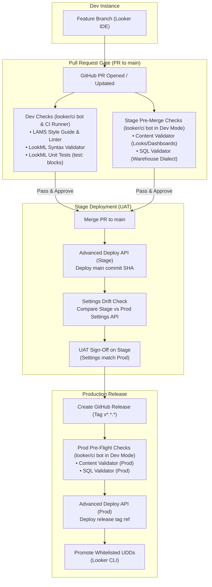
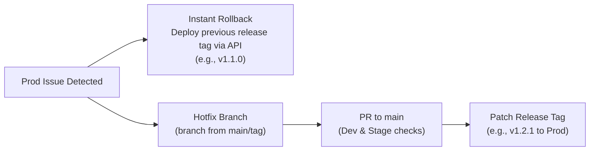

# Multi-Instance Looker CI/CD

Deployment workflow, testing gates, and API automation across three Looker environments: Dev, Stage (UAT), and Prod.

## Architecture Overview



## Environment Matrix

| Environment | Purpose | Developer LookML Access | LookML Source / Trigger | Deployment Method | Instance Settings & Feature Parity | Database Warehouse |
| :--- | :--- | :--- | :--- | :--- | :--- | :--- |
| **Dev** | Feature development and experimentation | **Read / Write** (IDE feature branches & personal Dev Mode) | Personal developer branches | Looker IDE git checkout | Previews, Labs flags, and experimental features can be turned on for testing | Dev warehouse dataset |
| **Stage** | UAT testing and pre-production validation | **No Write Access** (Read-only / UAT; automated via CI/CD) | `main` branch (deployed on PR merge) | Advanced Deploy API | Must match Prod settings, enforced by CI drift checks | Staging / masked warehouse dataset |
| **Prod** | Production analytics for end users | **No Write Access** (Read-only / consumption; automated via CI/CD) | Semantic release tags (`v*.*.*`) | Advanced Deploy API | Production baseline configuration | Production warehouse dataset |

## CI/CD Validation & Testing Gates

Validations run through the `looker/ci` bot service account with scoped workspace privileges.

```
                  ┌──────────────────────────────────────────────┐
                  │                 Pull Request                 │
                  └──────┬────────────────────────────────┬──────┘
                         │                                │
            [ Dev & CI Runner Target ]          [ Stage Instance Target ]
            ┌─────────────────────────┐         ┌───────────────────────┐
            │ • LAMS Style Guide Lint │         │ (bot enters Dev Mode) │
            │ • LookML Validation     │         │ • Content Validator   │
            │ • LookML Unit Tests     │         │ • SQL Validator       │
            │   (test: blocks)        │         │                       │
            └─────────────────────────┘         └───────────────────────┘
```

### Pull Request to main (Dev & Stage Gates)

When a developer opens a pull request against `main`, GitHub Actions runs two parallel validation suites:

- LAMS ([looker-open-source/look-at-me-sideways](https://github.com/looker-open-source/look-at-me-sideways)) runs `@looker/lams` against changed LookML files to verify naming conventions, primary keys, and description coverage.
- The `looker/ci` bot calls `validate_project` in Dev to catch syntax errors, missing references, and join issues.
- Native LookML `test:` blocks run via `run_lookml_test` to verify dimension calculations and business logic assertions.
- The `looker/ci` bot logs in and persists authentication using `looker-cli session login --token-file`.
- Switches the CI session into Dev mode (`looker-cli session update_session '{"workspace_id":"dev"}' --token-file`).
- Checks out the PR branch from `main` (`looker-cli project checkout <project_id> <branch> --token-file`).
- Runs the Content Validator in Dev Mode (`looker-cli api content_validator run_content_validator --token-file`) to catch broken Looks and Dashboards before code merges.
- Runs explore queries against the staging warehouse connection to verify dialect compatibility.

### Stage Promotion on Merge

When the PR merges into `main`, GitHub Actions deploys the code to Stage:

- Calls the Advanced Deploy API endpoint `POST /api/4.0/projects/{project_id}/deploy_ref_to_production?ref={commit_sha}` via Looker CLI (`looker-cli api project deploy_ref_to_production`).
- Compares Stage and Prod settings via `looker-cli api config get_setting` and `diff -u` to confirm settings parity.
- Stakeholders and analysts run UAT against Stage knowing the environment configuration matches Production.

### Production Release on Tag

When a release tag (`vX.Y.Z`) is created, GitHub Actions executes the release workflow on Prod ([.github/workflows/release-prod.yaml](.github/workflows/release-prod.yaml)):

1. Switches Prod session to `dev` mode with `--token-file`.
2. Checks out the release tag ref (`tags/vX.Y.Z`).
3. Runs Content Validator and SQL validation in Dev mode against live production metadata.
4. **Triggers and validates Persistent Derived Table (PDT) builds** in Dev mode to pre-warm warehouse tables and verify DDL execution before live traffic touches them.
5. On passing all Dev Mode validations and PDT builds, deploys the release tag to Production:
   `looker-cli api project deploy_ref_to_production <project_id> --ref tags/vX.Y.Z --token-file`
6. **Verifies Stage vs Prod settings parity** via `looker-cli api config get_setting` and `diff -u` before migrating content.
7. **Promotes whitelisted UDD content and Boards strictly from Stage to Production**:
   This promotion step only runs after all production release validators, deploy, and settings parity checks succeed.

## UDD Content & Board Migration (Stage > Prod)

LookML models and explores deploy through Git, while User-Defined Dashboards (UDDs), Looks, and Boards verified during Stage UAT migrate strictly from **Stage > Prod** using Looker CLI ([looker-open-source/looker-cli](https://github.com/looker-open-source/looker-cli)) and Looker SDK. Promotion is gated to run only after all production release validators pass.

Dev content is never promoted automatically. The Dev instance serves as a developer sandbox for rapid iteration and personal testing. To move dashboards from Dev into the release lifecycle, we recommend converting them into **LookML Dashboards** (`.dashboard.lookml` files) so they are version-controlled in Git and automatically deployed across all three instances. For one-off manual transfers, developers can run adhoc `looker-cli` commands (`looker-cli dashboard export <id>` and `looker-cli dashboard import <file>`).

### Shared Folder Whitelist

To keep personal folders and experimental UAT scratchpads out of Production, migrations only process folders listed in `config/content_folders_whitelist.yaml` (which always assumes Looker's root Shared folder):

```yaml
whitelist:
  - "CICD Demo"
  - "Executive Dashboards"
  - "Finance"
  - "Marketing Operations"
  - "Product Analytics"
```

Migration rules:

- Personal spaces under `/users/*` are ignored.
- Unlisted subfolders under `Shared/` are skipped.
- Folders are exported from Stage with `looker-cli folder export <folder_id> --dir ./content_export --host $LOOKER_STAGE_BASE_URL` and imported into Prod with `looker-cli folder import ./content_export/<folder_name> <prod_parent_id> --host $LOOKER_PROD_BASE_URL`.
- The migration runs via `.github/workflows/promote-udd-content.yaml` on release or manual trigger.

### Board Migration by Title

Because Looker internal database IDs differ across instances, Boards cannot be migrated by static IDs. Instead, `scripts/migrate_boards_cli.sh` resolves Board titles, sections, and pinned dashboards/looks across environments using `config/content_boards_whitelist.yaml`:

```yaml
boards:
  - "CICD Demo"
  - "Executive Overview"
  - "Sales & Operations"
```

Migration rules (`scripts/migrate_boards_cli.sh` via `looker-cli api`):

- Queries Stage for the board by title and reads all sections and pinned items (`looker-cli api board search_boards` / `board`).
- For each pinned dashboard or look, searches Production by title to resolve its corresponding Production ID (`looker-cli api dashboard search_dashboards`).
- Creates or updates the Board and sections in Production and pins the resolved items (`looker-cli api board create_board_item`).

## Instance Settings Parity & Governance

### Developer Access & LookML Governance

To enforce release integrity and prevent manual drift:

- **Dev**: Developers have full developer access to create feature branches, edit LookML in the IDE, and test in Development Mode.
- **Stage & Prod**: Developers do **not** have write access to LookML in Stage or Prod. LookML updates are deployed exclusively by the automated `looker/ci` service account via GitHub Actions using the Advanced Deploy API (`deploy_ref_to_production`). Direct LookML edits, branch creation, and manual commits by developers are disabled in Stage and Prod.

### Settings Drift Detection

Stage settings must match Prod to keep UAT reliable:

- `looker-cli api config get_setting` exports settings from Stage and Prod to JSON files (`stage_settings.json` and `prod_settings.json`).
- A standard `diff -u` compares both files, failing CI immediately if Labs flags, legacy features, or embed configurations diverge.
- Runs on every Stage deployment ([.github/workflows/deploy-stage.yaml](.github/workflows/deploy-stage.yaml)) and as a scheduled daily check in [.github/workflows/check-settings-drift.yaml](.github/workflows/check-settings-drift.yaml).

### Connection Configuration

All three instances define the same connection name (for example, `connection: "looker-private-demo"`). Each Looker Admin points that connection to the right backend warehouse:

- Dev points to developer or scratch datasets.
- Stage points to staging or masked datasets.
- Prod points to production datasets.

## Rollback & Hotfix Procedure



If an incident occurs in Production:

1. Re-deploy the last known good release tag (such as `v1.1.0`) to Prod using the Advanced Deploy API. This restores production in seconds without changing git history.
2. Cut a hotfix branch from the tag or `main`, open a PR to run Dev and Stage validation, merge to Stage for a quick sanity check, and publish a new patch release tag (`v1.2.1`).

## Project Structure

```text
├── .github/
│   └── workflows/
│       ├── pr-checks.yaml            # LAMS style linting + Dev LookML validation + Stage Content/SQL checks
│       ├── deploy-stage.yaml         # Advanced deploy to Stage on push to main + settings parity check
│       ├── release-prod.yaml         # Prod validation, PDT pre-build, deploy, settings diff & content promotion
│       └── promote-udd-content.yaml  # On-demand Looker CLI migration of whitelisted Shared folders & Boards
├── config/
│   ├── content_folders_whitelist.yaml # Whitelisted Shared folder names for Looker CLI
│   └── content_boards_whitelist.yaml  # Whitelisted Board titles for title-based migration
├── scripts/
│   └── migrate_boards_cli.sh         # Title-based Board migration script (Looker CLI API)
├── models/                           # LookML models
├── explores/                         # LookML explores
├── views/                            # LookML views
├── dashboards/                       # LookML dashboard definitions
├── .lamsignore                       # LAMS style guide ignore rules
├── DEMO.md                           # Interactive demo walkthrough
├── GLOSSARY.md                       # CI/CD terminology and tooling glossary
└── README.md
```

## Required GitHub Secrets & Configuration

Configure these secrets in your GitHub repository under **Settings > Secrets and variables > Actions > Secrets**:

| Secret / Variable Name | Description | Example / Format |
| :--- | :--- | :--- |
| `LOOKER_DEV_BASE_URL` | Host domain of the Dev Looker instance | `googledemo2.cloud.looker.com` (domain only, no `https://`) |
| `LOOKER_DEV_CLIENT_ID` | API3 Client ID for the `looker/ci` service account on Dev | `2x9hJkLmNpQr` |
| `LOOKER_DEV_CLIENT_SECRET` | API3 Client Secret for the `looker/ci` service account on Dev | `AbCdEf123456...` |
| `LOOKER_STAGE_BASE_URL` | Host domain of the Stage Looker instance | `stage.looker.com` (domain only, no `https://`) |
| `LOOKER_STAGE_CLIENT_ID` | API3 Client ID for the `looker/ci` service account on Stage | `4mN8pQrStUvW` |
| `LOOKER_STAGE_CLIENT_SECRET` | API3 Client Secret for the `looker/ci` service account on Stage | `GhIjKl789012...` |
| `LOOKER_PROD_BASE_URL` | Host domain of the Prod Looker instance | `prod.looker.com` (domain only, no `https://`) |
| `LOOKER_PROD_CLIENT_ID` | API3 Client ID for the `looker/ci` service account on Prod | `7xY1zAbCdEfG` |
| `LOOKER_PROD_CLIENT_SECRET` | API3 Client Secret for the `looker/ci` service account on Prod | `MnOpQr345678...` |
| `LOOKER_PROJECT_ID` *(Variable)* | Project ID of the LookML project (optional repository variable) | Default: `multi_instance_cicd_demo` |

> [!NOTE]
> - **Host Format**: `LOOKER_*_BASE_URL` must contain only the hostname/domain (e.g. `googledemo2.cloud.looker.com`). Do not include `https://`, port numbers, or trailing slashes. All API traffic runs over HTTPS via standard port `443`.
> - **Service Account Permissions**: The `looker/ci` API service account on each instance requires permissions to enter Dev Mode (`develop`), validate LookML (`see_lookml`), run tests and PDTs (`deploy`, `see_pdts`), and deploy code via the Advanced Deploy API.
